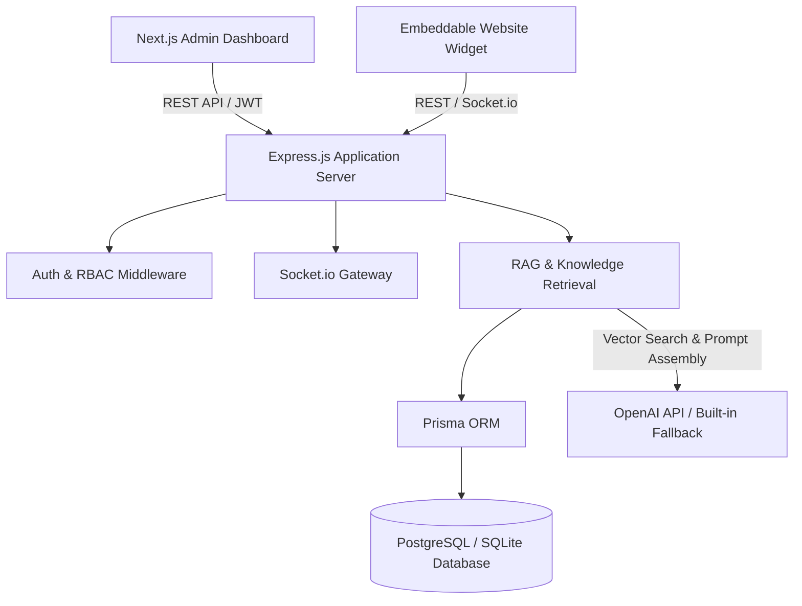
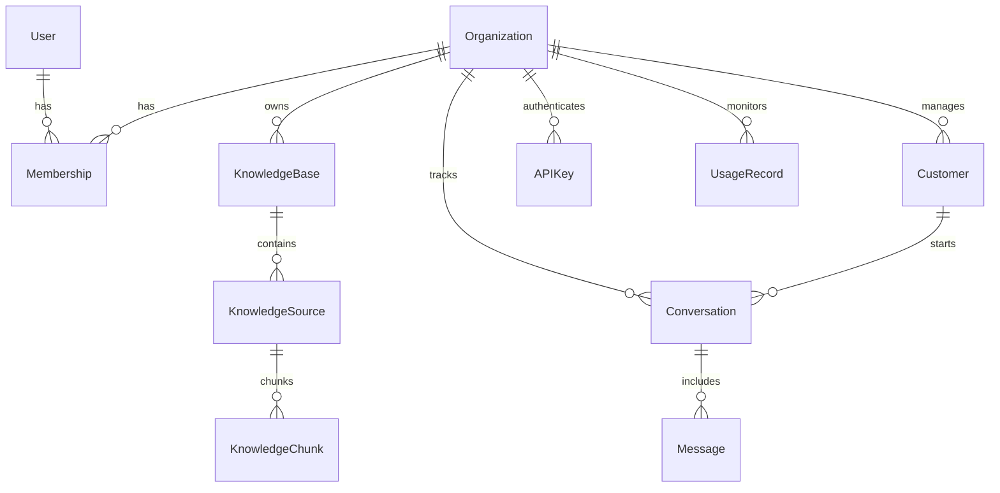

# Resolve — AI-Powered Customer Support Platform

> **Turn customer questions into resolved conversations.**

Resolve is a production-quality B2B SaaS application designed for small and medium-sized businesses to connect company knowledge bases, deploy AI customer support agents, manage real-time customer conversations, escalate complex queries to human agents, track support analytics, and integrate via an embeddable website widget.

---

## Technical Stack

* **Language**: JavaScript (ES6+ Node.js & React) — strictly no TypeScript.
* **Frontend**: Next.js 14, React 18, Tailwind CSS, Lucide Icons.
* **Backend**: Express.js, Socket.io (real-time agent inbox & customer widget sync).
* **Database & ORM**: PostgreSQL / SQLite with Prisma ORM.
* **Authentication**: JWT tokens, bcryptjs password hashing, HTTP-only cookie support.
* **RAG Engine**: Semantic text chunking, term-frequency vector embeddings, Cosine similarity retrieval, and OpenAI API integration with built-in fallback synthesis engine.
* **Containerization & CI**: Docker, Docker Compose, GitHub Actions.

---

## Architecture Diagram



---

## Core Product Features

1. **Business Workspaces & Multi-Tenancy**: Complete tenant isolation for organizations with custom slugs and settings.
2. **Role-Based Access Control (RBAC)**: Enforced backend & frontend permission tiers (`OWNER`, `ADMIN`, `AGENT`, `VIEWER`).
3. **Knowledge Base Management**: Upload URLs, Plain Text, FAQs, PDFs, and Markdown. Automatic semantic text chunking and vector indexing.
4. **RAG Architecture with Source Citations**: Answers customer questions using company knowledge. Includes confidence threshold checking (defaults to 0.65) to abstain from hallucinating and offer human escalation.
5. **Support Inbox**: Real-time agent workspace with Socket.io message synchronization, status transitions (`OPEN`, `WAITING`, `ESCALATED`, `RESOLVED`), internal notes, and team assignments.
6. **Embeddable Chat Widget**: Standalone JavaScript widget (`public/widget.js`) with live stream responses, CSAT feedback ratings, and human escalation handoff.
7. **Analytics**: Real-time resolution rates, escalation metrics, average CSAT score (out of 5.0), response time tracking, top cited sources, and knowledge gaps.
8. **Customer Directory**: Customer profiles, satisfaction history, and tags.
9. **API Keys**: Create and revoke hashed secret API keys for backend integrations.
10. **Usage Tracking**: Monthly quota tracking for AI messages, knowledge sources, and team members.

---

## Database Design



---

## Quick Start & Local Setup

### 1. Prerequisites
- Node.js v18+ and npm v9+

### 2. Installation & Setup
```bash
# Clone repository
git clone https://github.com/resolve/resolve.git
cd Resolve

# Install dependencies
npm install

# Copy environment variables
cp .env.example .env

# Push Prisma Database Schema & Seed Demo Data
npx prisma db push
node prisma/seed.js

# Start Development Server (Express + Next.js + Socket.io)
npm run dev
```

The application will be running at [http://localhost:3000](http://localhost:3000).

---

## Demo Credentials

The database is pre-seeded with a realistic B2B SaaS workspace (**Acme Cloud Solutions**):

| Role | Email | Password |
|---|---|---|
| **Owner** | `alex@acmecloud.io` | `password123` |
| **Agent** | `sarah@acmecloud.io` | `password123` |
| **Viewer** | `david@acmecloud.io` | `password123` |

---

## Running Tests

Execute integration and unit test suite:
```bash
npm test
```

---

## Environment Variables

| Variable | Description | Default |
|---|---|---|
| `PORT` | HTTP server port | `3000` |
| `DATABASE_URL` | SQLite / PostgreSQL connection URI | `file:./dev.db` |
| `JWT_SECRET` | Secret key for signing JWT tokens | `resolve_super_secret_jwt_key_2026_prod_key` |
| `OPENAI_API_KEY` | (Optional) OpenAI API key for LLM completions | `""` |
| `NODE_ENV` | Environment state (`development`/`production`) | `development` |

---

## Deployment & Docker

Run using Docker Compose:
```bash
docker-compose up --build
```
